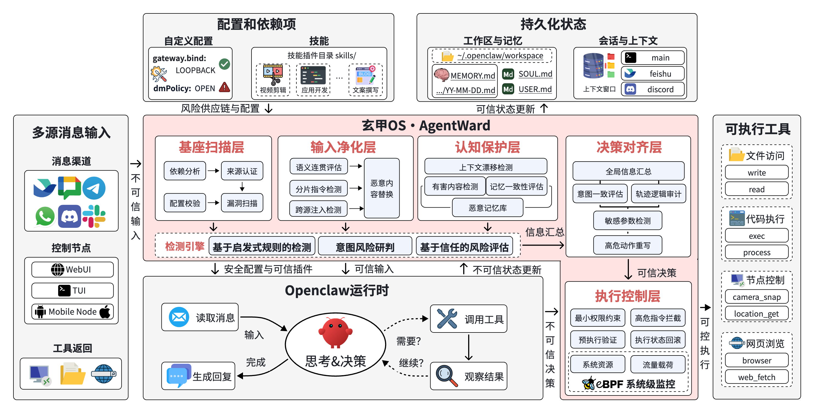

# AgentWard · 玄甲OS

**AgentWard (玄甲)** is the full-lifecycle security operating system for AI agents — purpose-built security framework for trustworthy, scalable AI agent deployment.
Natively integrated with OpenClaw, AgentWard unifies agent onboarding, secure reasoning, and trusted execution in one cohesive security architecture, with upcoming native support for other leading mainstream agent frameworks. Its heterogeneous defense-in-depth design rearchitects the agent workflow into five coordinated security layers across startup, perception, memory, decision-making, and execution, with dynamic cross-stage protections that verify foundation integrity, block adversarial deception, stop memory tampering, and validate every autonomous decision and high-risk command —  a complete, end-to-end closed security loop that delivers on the promise of "trustworthy at inception, controllable throughout the process, and reliable in outcomes".

## Why AgentWard

- 🛡️ **Comprehensive Risk Coverage** — Heterogeneous Defense-in-Depth (DiD) architecture delivers full-scope agent security assurance, blocking diverse attack vectors across the entire agent attack surface.
- ⚡ **One-Click Deployment** — Plugin-native design weaves security natively into the full agent lifecycle. Enable comprehensive agent security with one click via non-intrusive integration, which guarantees seamless and fast version adaptation for OpenClaw.
- 🔒 **Deterministic System-Level Controls** — Delivers deterministic, fully auditable, code-enforced security that outperforms skill-based solutions depending on endogenous security, with native support for large-scale deployment and production-grade readiness.
- 🌐 **Open & Extensible Security Standard** — Community-driven, transparent and auditable open standard with a modular architecture designed for extensibility. Built with complete framework-algorithm decoupling for effortless integration of advanced detection algorithms, with a roadmap to extend support to general agentic systems.

## Quick Start

1. ⚡ **Installation**

   ```bash
   # One-click deployment
   openclaw plugins install /path/to/agent-ward
   ```
2. 📥 **Enable Plugin**
   Edit `~/.openclaw/openclaw.json`:

   ```json
   {
       "plugins": {
           "allow": ["agent-ward"],
           "entries": {
           "agent-ward": {
               "enabled": true
               }
           }
       }
   }
   ```
3. ✅ **Verify Installation**

   ```bash
   openclaw plugins list
   ```

   Then enjoy enhanced security for your OpenClaw!

## Systematic Architecture

**AgentWard** is natively and deeply integrated with the OpenClaw platform and embeds native security capabilities into the full lifecycle workflow of AI agents. Its heterogeneous defense-in-depth architecture reconstructs isolated single-point security checks into a closed-loop, coordinated system-level protection system, delivering end-to-end, full-chain trustworthy assurance for AI agents from startup through to execution.



### Five Coordinated Defense Layers

AgentWard delivers **system-level security** through five tightly integrated layers that work in tandem — transforming isolated security checks into a unified, end-to-end protection system for AI agents.

| Layer                         | Focus                                     |
| ----------------------------- | ----------------------------------------- |
| 🏗️ Foundation Scan Layer    | Supply chain trust and baseline integrity |
| 🧼 Input Sanitization Layer   | Prompt injection and jailbreak detection  |
| 🧠 Cognition Protection Layer | Memory poisoning and context drift        |
| 🎯 Decision Alignment Layer   | Intent consistency before action          |
| 🔧 Execution Control Layer    | High-risk operation guardrails            |

### 🚨 Threat Response and Mitigation

- 📢 Send alert messages via IM when threats are detected
- 🛑 Automatically block dangerous operations without human intervention
- 📝 Clear warning descriptions to help understand risks

### ⚙️ Flexible Configuration

- 🎚️ Each protection layer can be enabled/disabled independently
- 👁️ Supports "detection-only" mode to reduce false positive impact
- 📋 Some layers support custom rules to meet specific scenario requirements

## Defense Visualization

### 🏗️ Layer 1: Foundation Scan

Ensures the agent starts from a trustworthy foundation.

<video src="https://github.com/user-attachments/assets/3842d195-635f-4b22-a9ef-1c4a3aaf12bf" controls preload="metadata" width="480"></video>

### 🧼 Layer 2: Input Sanitization

Identifies adversarial inputs before they propagate into the agent.

<video src="https://github.com/user-attachments/assets/9491c8cd-4d30-4b57-8e88-7cc438762cb6" controls preload="metadata" width="480"></video>

### 🧠 Layer 3: Cognition Protection

Protects long-term memory and contextual continuity from poisoning.

<video src="https://github.com/user-attachments/assets/33ee07a9-8311-4952-9439-d22471b9939c" controls preload="metadata" width="480"></video>

### 🎯 Layer 4: Decision Alignment

Keeps agent decisions aligned with authorized user intent.

<video src="https://github.com/user-attachments/assets/72cbb62a-d91e-4b09-8b28-84423833c2c4" controls preload="metadata" width="480"></video>

### 🔧 Layer 5: Execution Control

Enforces safety boundaries at the point of execution.

<video src="https://github.com/user-attachments/assets/39d9886f-4083-45d3-a5c6-d15a13c77ed7" controls preload="metadata" width="480"></video>

## Roadmap

### 🏆 Full Stack System Implementation

- 📐 System Infrastructure Framework
    - ✅ Plugin-Native Modular Architecture
    - ✅ Base Adapters Suite
    - ✅ Core Detection Engine
        - ✅ Heuristic Rule-Based Detection Module
        - ✅ Intent Risk Judgment System
        - 🚀 Trust-Based Risk Assessment Capability
- 🏗️ Foundation Scan Layer
    - ✅ Rule-Based Injection & Jailbreak Detection
    - ✅ Input Semantic Coherence Evaluation
    - ✅ Fragmented Malicious Instruction Detection
    - 🚀 Multi-Round Stealth Attack Detection
    - 🚀 Malicious Content Secure Replacement
    - 🚀 Multi-Modal Injection Attack Detection
- 🧼 Input Sanitization Layer
    - ✅ Rule-Based Injection & Jailbreak Detection
    - ✅ Input Semantic Coherence Evaluation
    - ✅ Fragmented Malicious Instruction Detection
    - 🚀 Multi-Round Stealth Attack Detection
    - 🚀 Malicious Content Secure Replacement
    - 🚀 Multi-Modal Injection Attack Detection
- 🧠 Cognition Protection Layer
    - ✅ Memory Consistency Evaluation & Calibration
    - 🚀 Malicious Memory Library Construction & Threat Matching
    - 🚀 Memory Vectorization & Outlier Detection
    - 🚀 Context Drift Detection & Correction
- 🎯 Decision Alignment Layer
    - ✅ Agent Decision vs User Intent Consistency Validation
    - ✅ Sensitive Operation Parameter Detection & Compliance Verification
    - 🚀 Inference Trajectory Logic Audit
    - 🚀 High-Risk Decision Action Recognition & Rewriting
- 🔧 Execution Control Layer
    - ✅ Real-Time Interception & Blocking of High-Risk System Instructions
    - ✅ Behavioral Intent Analysis & Risk Assessment
    - 🚀 Identity-Based Dynamic Permission Control & Access Restriction
    - 🚀 Pre-Execution Security Validation for Agent Actions
    - 🚀 Automatic Rollback & Recovery of Abnormal Execution States
    - 🚀 eBPF-Powered System-Level Full Monitoring
        - 🚀 Real-Time System Resource Usage Monitoring & Dynamic Restriction
        - 🚀 Network Traffic Payload Audit & Anomaly Detection
- 🤝 Layer Collaboration
    - ✅ Global Information Aggregation & Risk Discovery
    - 🚀 Historical Behavior-Based Trust Profile Construction
    - 🚀 Role-Based Risk Rating & Dynamic Permission Allocation
    - 🚀 Taint Propagation & System Audit
